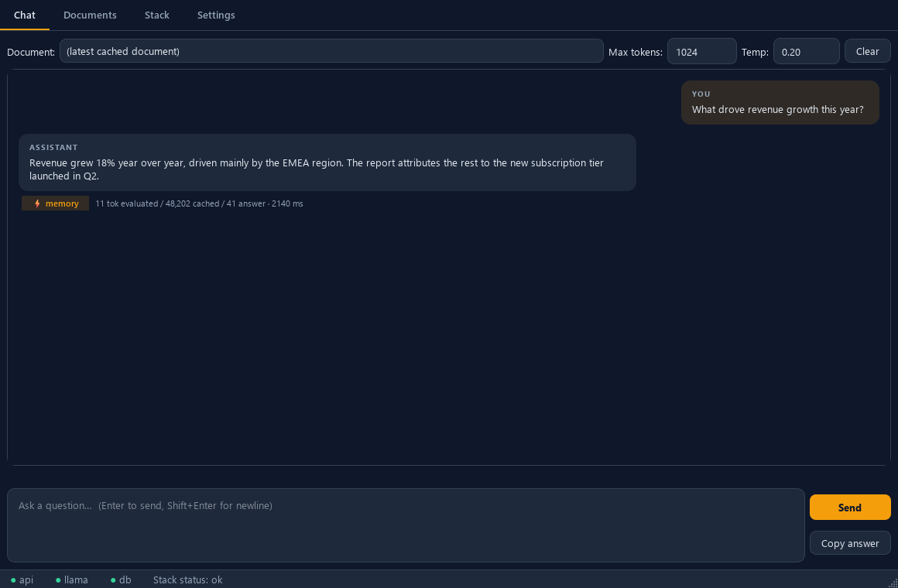
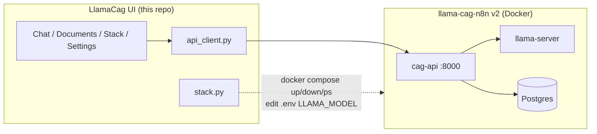
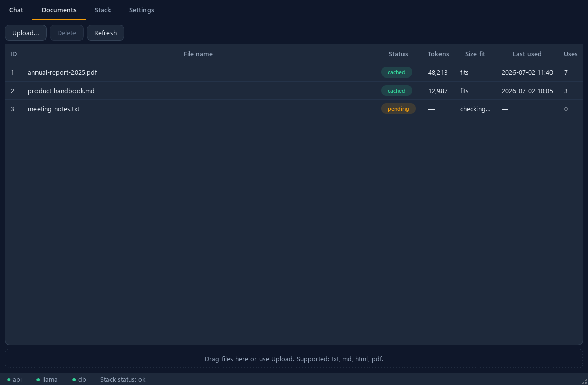
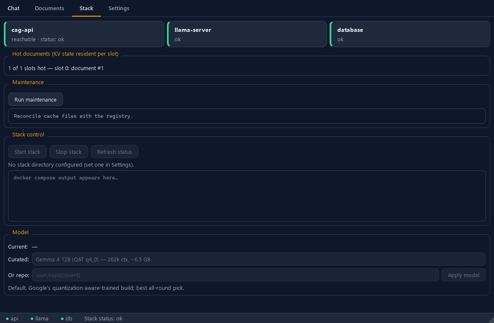

# LlamaCag UI

**Chat with your documents from your desktop.** A lightweight PySide6 client for
the [llama-cag-n8n](https://github.com/VictorSteinbock/llama-cag-n8n) v2 stack —
pick a document, ask questions, and get answers grounded in *that* document,
fast, because the model's read of it stays cached in memory.



## What this is (and isn't)

LlamaCag UI is a **thin client**. Everything hard — running the language model,
warming a document into a KV cache, persisting and restoring that cache, slot
management — lives server-side in the llama-cag-n8n stack (`cag-api` +
`llama-server` + Postgres). This app does two things: **HTTP** (to `cag-api`)
and **pixels**.

That is deliberate. An earlier version tried to be the app *and* the inference
engine — embedding `llama-cpp-python`, pickling KV state to disk, hand-rolling a
warm-up mode — and collapsed under the state-management complexity. v2 hands all
of that to proven upstream code and stays a client.

- **No embedded inference.** The app never links a local model. If the stack is
  down, it says so and offers to start it.
- **One network module** (`api_client.py`), **one subprocess module**
  (`stack.py`), **all UI updates via Qt signals** from a single `Worker`.
- **No streaming tokens yet** — `/query` is request/response; you see a
  generating state, then the answer with timings.

## How it relates to the stack



*Not technical? The stack's
[plain-words explainer](https://github.com/VictorSteinbock/llama-cag-n8n-reworked/blob/main/docs/EXPLAINER.md)
tells the whole story in two minutes.*

This app is the **desktop control room** of the
[llama-cag-n8n stack](https://github.com/VictorSteinbock/llama-cag-n8n-reworked)
— one engine with three other faces: a typed HTTP API, **n8n automation**
(folder-drop ingestion, query webhook, nightly maintenance, question sweeps),
and an **MCP server** that lets Claude Code query your local document memory
(`claude mcp add cag -- python -m cag_mcp`) so dense documents never ride along
in cloud context. Ancestry: a ground-up rebuild of the original
[AbelCoplet/LlamaCagUI](https://github.com/AbelCoplet/LlamaCagUI).

## Quickstart

### 1. Start the stack first

LlamaCag UI needs a running llama-cag-n8n stack to talk to. Clone it as a
sibling directory and bring it up:

```bash
git clone https://github.com/VictorSteinbock/llama-cag-n8n
cd llama-cag-n8n
python llamacag.py setup     # generates .env with secrets
python llamacag.py start     # docker compose up (downloads the model on first run)
```

The default model (Gemma 4 12B, ~6.5 GB) downloads once into a Docker volume.
`cag-api` listens on `http://localhost:8000`.

### 2. Install and run the UI

```bash
git clone https://github.com/VictorSteinbock/LlamaCagUI
cd LlamaCagUI
python -m venv .venv
# Windows:  .venv\Scripts\activate
# macOS/Linux:  source .venv/bin/activate
pip install -e .
llamacag-ui
```

On first launch a welcome dialog explains CAG and walks you from your first
document to your first answer. The app auto-detects a sibling `llama-cag-n8n*`
directory so stack control works out of the box.

### 3. Your first answer

1. **Documents tab** → drag a file onto the table (or **Upload**). Watch its
   status go `pending` → `cached`. Warming a large document can take minutes on
   CPU — that is normal.
2. **Chat tab** → pick the document (or leave *(latest)*), type a question,
   press **Enter**.
3. Read the footer badge: **⚡ memory**, **💾 disk**, or **🔁 recomputed**, plus
   how many tokens were evaluated vs. reused, and the round-trip time.

## Features

| Surface | What you can do |
|---------|-----------------|
| **Chat** | Multi-turn Q&A; per-conversation document pick; `max_tokens` / `temperature`; Enter-to-send; per-answer cache-source badge + token/timing footer; copy answer; clear conversation. History (last 20 turns) is sent to `/query`. |
| **Documents** | Table of id / name / status / tokens / size-fit / last used / uses; upload via dialog **and** drag-drop; delete with confirm; auto-refresh; dedupe surfaced as "already ingested". |
| **Stack** | Health cards for cag-api / llama-server / database; hot documents per slot; maintenance report (orphans, missing caches, disk usage); Start/Stop + `docker compose` log tail; model switcher (curated list + free-form `repo[:quant]`). |
| **Settings** | cag-api base URL (with **Test**); stack directory (with auto-detect); chat defaults; re-show the welcome dialog. Persisted via `QSettings`. |
| **Status bar** | Colored dots for api / llama / db, polled every 10 s off-thread. The app stays responsive when the stack is down. |




## Settings reference

Stored under `QSettings("LlamaCag", "LlamaCagUI")`:

| Key | Default | Meaning |
|-----|---------|---------|
| `api_url` | `http://localhost:8000` | Base URL of `cag-api`. Point it at a remote host for pure-client mode. |
| `stack_dir` | auto-detected | Path to the llama-cag-n8n checkout. Enables stack control when it contains `docker-compose.yml`. |
| `chat/max_tokens` | `1024` | Default answer length. |
| `chat/temperature` | `0.2` | Default sampling temperature. |
| `ui/show_welcome` | `true` | Whether the welcome dialog shows on launch. |

## Troubleshooting

- **Status dots are red / "cag-api unreachable".** The stack isn't running. Open
  the **Stack** tab and click **Start** (if a stack directory is configured), or
  start it manually with `python llamacag.py start` in the stack repo.
- **A document sits at `pending` for a long time.** Warming a large document on
  CPU is genuinely slow (minutes for tens of thousands of tokens). The status
  column flips to `cached` when it finishes; a toast confirms it.
- **Upload rejected (413 / 415).** 413 means the document exceeds the per-slot
  token budget — raise `LLAMA_CTX_SIZE` in the stack's `.env` and restart, or
  ingest a smaller file. 415 means the file type isn't supported (txt, md, html,
  pdf are).
- **Switched models and old answers look wrong.** Existing caches were built for
  the previous model. They re-heal (recompute once) on next use — the first
  query per document after a switch is slow, then fast again.
- **"Docker not found" on the Stack tab.** Stack control needs Docker on `PATH`.
  Without it, the app still works as a pure client against `api_url`.

## Development

```bash
pip install -e ".[dev]"

ruff check .

# Tests run headless with a mocked transport — no Docker, no network.
QT_QPA_PLATFORM=offscreen pytest -q

# Regenerate README screenshots (offscreen render with fixture data).
QT_QPA_PLATFORM=offscreen python scripts/make_screenshots.py
```

The test suite drives the real widgets against an in-memory fake `cag-api`
(`tests/conftest.py`, `httpx.MockTransport`) — the same fake-driven approach the
sibling repo uses. See `CLAUDE.md` for the module rules.

Runtime dependencies are just **PySide6** and **httpx**.

## License

MIT — see [LICENSE](LICENSE). Copyright (c) 2025-2026 VictorSteinbock.
