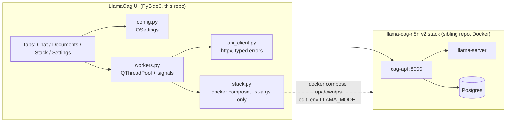

# Architecture — LlamaCag UI v2

A PySide6 desktop app that is a pure HTTP client of the llama-cag-n8n v2 stack,
plus an optional local controller for that stack's docker compose.

## Module responsibilities

| Module | Owns | Never does |
|--------|------|-----------|
| `llamacag_ui/api_client.py` | All knowledge of cag-api: endpoints, payloads, error-code → exception mapping, timeouts | Qt imports, threading |
| `llamacag_ui/stack.py` | Find stack dir, `docker compose ps/up/down`, read+patch `.env` `LLAMA_MODEL`, restart llama-server | `shell=True`, arbitrary commands |
| `llamacag_ui/config.py` | QSettings persistence (api_url, stack_dir, chat defaults, welcome flag) | Business logic |
| `llamacag_ui/workers.py` | `Worker(fn, *args)` on `QThreadPool`, emits `finished(result)` / `failed(exc)` | UI mutation |
| `llamacag_ui/models_catalog.py` | Curated model list (mirrors stack `.env.example` table) | Network |
| `llamacag_ui/ui/*` | Widgets, layout, signal wiring, presentation of results/errors | Direct httpx/subprocess calls |

**The v1 lesson encoded:** exactly one module touches the network, exactly one
touches subprocess, all UI updates arrive via Qt signals from `Worker`. No
module holds inference state — there is none client-side.

## The cag-api contract (source of truth: sibling repo `api/`)

Base URL from settings (default `http://localhost:8000`). Reference
implementation and response shapes: `../llama-cag-n8N/api/app/main.py` and its
tests. Summary used by this app:

| Call | Request | Response (fields used) |
|------|---------|------------------------|
| `GET /health` | — | 200/503; `{status, hot_documents: {slot: doc_id}, slots, llama_server: {...}\|{error}, database: "ok"\|{error}}` |
| `GET /documents` | — | `{documents: [{id, file_name, status, n_tokens, cache_file, error, created_at, cached_at, last_used_at, use_count}]}` |
| `POST /documents` | multipart `file` | 201 doc object (+ `deduplicated`, `warm_ms`); 413 `{detail, n_tokens, limit}`; 415 `{detail}` |
| `DELETE /documents/{id}` | — | 200 `{deleted}`; 404 |
| `POST /query` | `{question, document_id?, max_tokens?, temperature?, history?: [{role: user\|assistant, content}] (≤50)}` | `{answer, document: {id, file_name, n_tokens}, duration_ms, timings: {prompt_tokens_evaluated, prompt_tokens_from_cache, answer_tokens, cache_source: memory\|disk\|recomputed}}`; 409 no docs; 404 bad id; 502 llama down |
| `POST /maintenance` | — | `{orphan_files_removed[], orphan_files_failed[], missing_cache_files[], cache_files, cache_bytes, documents, cached_documents, queries_24h, avg_duration_ms_24h}` |

`api_client.py` raises: `ApiUnreachable` (connect/timeout), `StackDegraded`
(503), `NoDocuments` (409), `NotFound` (404), `DocumentTooLarge` (413, carries
n_tokens/limit), `UnsupportedFile` (415), `InferenceError` (502), `ApiError`
(anything else) — each with the server `detail` when present. Timeouts:
health 5 s, documents list/delete 30 s, upload 3600 s, query 3600 s,
maintenance 300 s.

## Threading model

- `QThreadPool.globalInstance()` + a single generic `Worker(QRunnable)`.
- Signals: `finished(object)`, `failed(str, object)` — marshalled to the UI
  thread by Qt automatically.
- Status poller: one repeating 10 s `QTimer` → health worker; result feeds the
  status bar and enables/disables stack-dependent controls.
- Chat send / upload / maintenance / stack ops each disable their own trigger
  control while in flight (no global lock; the server serializes inference).

## Stack control (optional capability)

Enabled iff `stack_dir` is configured and contains `docker-compose.yml`.
Auto-detection at first run: sibling directories matching `llama-cag-n8*`.

- Status: `docker compose ps --format json`
- Start/stop: `docker compose up -d` / `down` (cwd = stack dir)
- Model switch: regex-replace `^LLAMA_MODEL=.*` in `.env`, then
  `docker compose up -d llama-server` (recreates just that service)
- All subprocess calls use list arguments; stdout tail streamed to the Stack
  tab via the worker's progress signal.

## Config persistence

`QSettings("LlamaCag", "LlamaCagUI")` — same org/app as v1, so the v1 welcome
flag carries over harmlessly. Keys: `api_url`, `stack_dir`, `chat/max_tokens`,
`chat/temperature`, `ui/show_welcome`.

## Testing strategy

- `tests/conftest.py` builds `ApiClient` on `httpx.MockTransport` implementing a
  tiny in-memory cag-api (documents dict + canned query responses + toggleable
  health) — the same fake-driven approach the sibling repo uses.
- Unit: api_client (each error status → right exception), stack (constructed
  argv, .env patching on a tmp copy), models_catalog sanity.
- UI smoke (pytest-qt, `QT_QPA_PLATFORM=offscreen`): window construction, tab
  presence, documents table populates from fake, chat send round-trip renders
  an answer bubble with badge, degraded health disables send.
- CI (GitHub Actions, ubuntu): install Qt libs (`libegl1`, `libgl1`,
  `libxkbcommon-x11-0` + xcb deps), `ruff check .`, `pytest -q` offscreen.

## Screenshot generation (README visuals that don't rot)

`scripts/make_screenshots.py`: offscreen QApplication, main window fed by the
test fake (3 documents, one conversation with a `memory` badge, healthy status
bar), `widget.grab().save("docs/images/<name>.png")` for: welcome dialog, chat,
documents, stack tabs. Run manually when UI changes; images committed.

## Failure modes

| Failure | Behaviour |
|---------|-----------|
| Stack down | Dots red, chat send disabled with message, Stack tab offers Start (if stack_dir), everything else browsable |
| llama-server still loading model | Health shows degraded with llama error; documents list still works (db up); chat send disabled |
| Warm in progress on upload | Documents table shows `pending`; poller flips it to `cached`; toast on completion |
| Query 502 mid-conversation | Error bubble in transcript with detail; history preserved; retry allowed |
| Docker absent | Stack controls disabled with "Docker not found" explanation; pure-client mode still works against a remote api_url |
